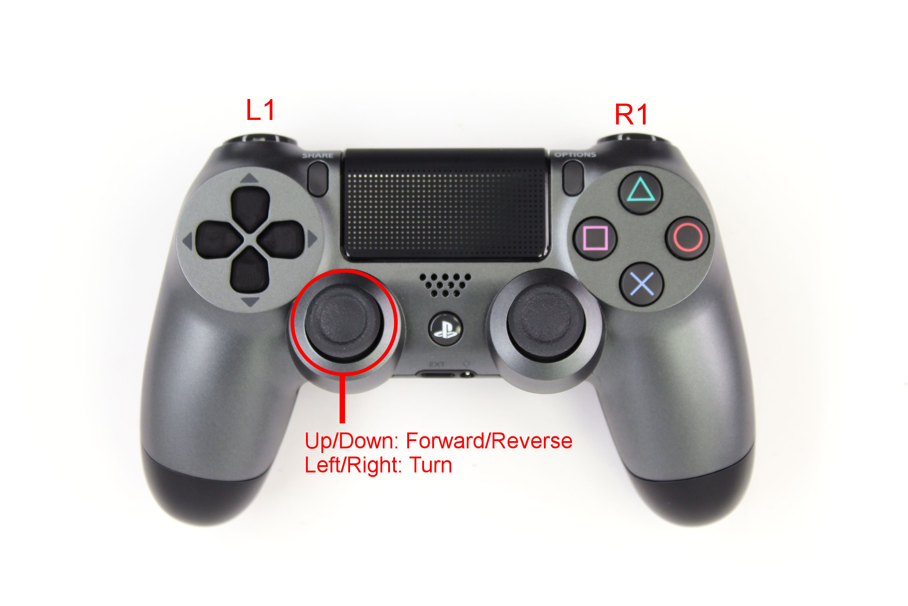

Driving Boxer
===============

Boxer can either drive autonomously, be :doc:`controlled through ROS messages <BoxerSimulation>`, or you
can use the supplied remote control to teleoperate it.

Safety Precautions
----------------------

.. warning::

    Despite its small size, Boxer is capable of reaching high speeds.  Careless driving can cause harm to the operator,
    bystanders, the robot, or other property.  Always remain vigilant, ensure you have a clear line of sight to the
    robot, and operate the robot at safe speeds.

Remote Control
-----------------

Boxer uses a standard Sony Playstation 4 controller for teleoperation.  The left thumb stick is used to control the
robot's speed and direction.  Either L1 or L2 must be held down at all times while driving the robot.  Holding R1
will enable the robot to drive at maximum speed, while holding L1 will restrict the robot's maximum speed.

.. warning

    While familiarizing yourself with the robot we recommend operating at low speed by holding L1.  Only engage
    full speed (by holding R1) once you are familiar with the robot and there is a safe distance of at least 3m
    around the robot.

If your controller is not pairing correctly with the robot, you can re-pair it by following these steps:

1. Ensure that the controller's batteries have sufficient charge
2. Press and hold the Share & PS buttons on the controller until the pairing light flashes rapidly white
3. Run the following command on Boxer:

.. code-block:: bash

    sudo ds4drv-pair

The controller should now be paired.  Test it by pressing L1 and using the left control stick.

E-Stop Buttons and Safety Lidar
--------------------------------

Boxer is equipped with a large, red emergency-stop button on the rear of the robot.  Pressing this button will
cut power to the robot's motors.  To release the e-stop, grasp the button firmly and pull it back out.  Once the
button is released, press the E-Stop Reset button, located above the E-Stop, beside the charging port.

Whenever you need to perform maintenance on the robot we recommend engaging the emergency-stop if the robot cannot be
fully powered down.

Boxer is also equipped with safety lidars in the front and back that will cause the robot to lose power if a collision
is predicted, or if the robot is operating too fast in an enclosed environment.  The safety stop is automatic, and is
not controlled through any ROS topics.  Once the danger has passed the safety stop will automatically disengage.

If Boxer seems to be stuck in a safety stop, check that there is no dirt or debris on either the front or rear
lidars.  Wipe the lidars down using an appropriate lidar wipe or soft cloth to remove any dirt.

Body Lights
--------------

Boxer includes RGB LED strips around its body.  These lights express system status according to the table below.

+-----------------+--------------------------------------------------------------------------------+
| Color & Pattern | Meaning                                                                        |
+=================+================================================================================+
| Solid Red       | Robot is starting up                                                           |
+-----------------+--------------------------------------------------------------------------------+
| Flashing Red    | Robot is E-Stopped or Safety Stopped                                           |
+-----------------+--------------------------------------------------------------------------------+
| Circling Blue   | Base platform is in Manual mode, allowing it to be controlled via the ROS2 API |
+-----------------+--------------------------------------------------------------------------------+

At present these lights are not controllable through any ROS topics, but this is planned for a future update.
