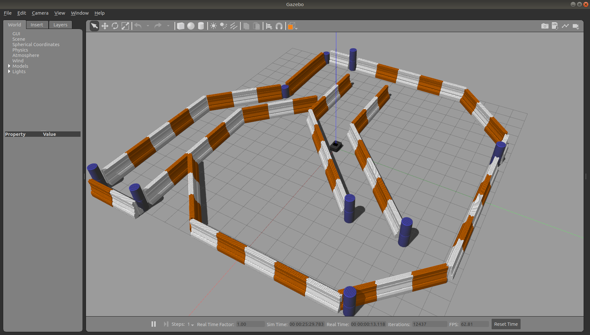

Mapping & Navigation with Boxer
===================================

.. note::

    Before you can run the commands in this tutorial, make sure to install Boxer's navigation packages:

    .. substitution-code-block:: bash

        sudo apt-get install ros-|ros_distro|-boxer-navigation

This section explains how to use three different navigation modes for Boxer.

* Navigating in an odometric frame without a map,
* Creating a map using gmapping
* Localization in a known map using amcl.

If you are working in a simulation, bring up Boxer using the following command:

.. code-block:: bash

    roslaunch boxer_gazebo boxer_world.launch

This will create a simulated Boxer with a front-mounted laser scanner.

If you are instead working with a real robot, we suggest connecting to the robot wirelessly over SSH and launching
the ROS launchfiles from onboard the robot.  Be sure to :doc:`configure Boxer's network <BoxerNetwork>` appropriately
to allow bi-directional communication with the robot's ROScore.

Navigating Without a Map
------------------------------

In the odometry navigation demo Boxer attempts to reach a given goal in the world within a user-specified tolerance.
The 2D navigation, generated by move_base, takes in information from odometry, laser scanner, and a goal pose and
outputs safe velocity commands. In this demo the configuration of move_base is set for navigation without a map in an
odometric frame (that is, without reference to a map).

To launch the navigation demo, run:

.. code-block:: bash

    roslaunch boxer_navigation odom_navigation_demo.launch

To visualize with the suggested rviz configuration launch:

.. code-block:: bash

    roslaunch boxer_viz view_robot.launch config:=navigation

To send goals to the robot, select the 2D Nav Goal tool from the top toolbar in rviz, and then click anywhere in the
rviz view to set the position. When placing the 2D Nav Goal you may also click and hold to set the goal orientation as
well as the location.

If you wish to customize the parameters of move_base, local costmap, global costmap and base_local_planner,
clone boxer_navigation into your own workspace and modify the corresponding files in the params subfolder.

Creating a Map with Gmapping
----------------------------------

Gmapping is an open-source tool for Simultaneous Localization And Mapping, or SLAM.  SLAM allows a robot to build a
map of its environment while exploring, making it helpful when the robot is in unfaimilar environments.

This section explains how to produce a map using gmapping.  We will then use this map to set 2D nav goals in the
following section.

To begin, run the following command:

.. code-block:: bash

    roslaunch boxer_navigation gmapping.launch

In a second terminal, run the following command:

.. code-block::bash

    roslaunch boxer_viz view_robot.launch config:=gmapping

.. note::

    If you are driving a simulated Boxer you may find it easyer to launch rviz without the gmapping configuration:

    .. code-block:: bash

        roslaunch boxer_viz view_robot.launch

Now slowly drive the robot around to produce a map.  If you are driving the robot using the interactive controls in
rviz you may find it helpful to change the visulaization's fixed frame from ``map`` or ``odom`` to ``base_link``.  Doing
so will keep the robot in a fixed position in the window, while the world rotates around the robot.

When you are satisfied that you have adequately mapped the area, you can run the following command to save the map
using map_saver_:

.. code-block:: bash

    rosrun map_server map_saver -f mymap

This will create a ``mymap.yaml`` and ``mymap.pgm`` file in your current directory.

.. _map_saver: http://wiki.ros.org/map_server#map_saver

The resulting map should look something like this:

Navigating Using a Map
------------------------------

Using :roswiki:`amcl`, Boxer is able to globally localize itself in a known map. AMCL takes in information
from odometry, laser scanner and an existing map and estimates the robot's pose.

To start the AMCL demo:

.. code-block:: bash

    roslaunch boxer_navigation amcl_demo.launch map_file:=/path/to/my/map.yaml

If you don't specify ``map_file``, it defaults to an included pre-made map of the default "Boxer World"
environment which Boxer's simulator spawns in. If you're using a real Boxer in your own environment,
you'll definitely want to override this with the map created using the gmapping demo.

Before navigating, you need to initialize the localization system by setting the pose of the robot in the map.
This can be done using 2D Pose Estimate in rviz or by setting the amcl initial_pose parameters. To visualize
with the suggested rviz configuration launch:

.. code-block:: bash

    roslaunch boxer_viz view_robot.launch config:=localization

When rviz appears, select the *Set 2D Pose tool* from the toolbar, and click on the map to indicate to the robot
approximately where it is.

Advanced
--------

If you have an application which requires faster or more accurate SLAM capabilities, our commercial offerings
may be a good fit for your team. Please `get in touch for more details`__.

.. _contact: http://www.clearpathrobotics.com/contact/
__ contact_
