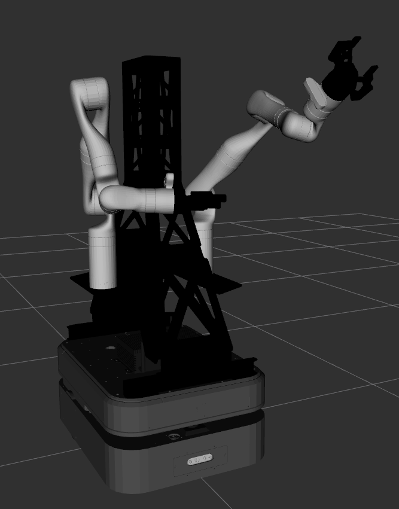

Boxer Overview
================

.. Note::

    Otto Motors and Clearpath Robotics are sister companies, both operating under the same parent company.
    Boxer 2.4 is a collaboration between the teams at Otto Motors and Clearpath Robotics.

Boxer 2.4 is a lightly modified `Otto 100 <https://ottomotors.com/amrs>`_ robot, equipped with an external PC mounted
to the top of the robot.  This external PC communicates with the Otto 100 via the Otto's attachment port, located
at the rear of the robot.

Terminology
------------

The following terms are used throughout this guide:

- Backpack PC: the externally-mounted computer that has the ROS Master running on it.
- Base Platform: the Otto 100 platform, including its internal PC.  Sometimes referred to as "The Otto 100"
- Boxer: the combined Base Platform and Backpack PC

Differences from Otto 100
--------------------------

The most obvious difference between Otto 100 and Boxer 2.4 is that Boxer has been painted black with a yellow
stripe on the sides.  This change is purely cosmetic, and is to keep the Boxer visually distinct.

Mechanically the top deck of the Boxer has a slightly thicker, heavier top-plate with a different arrangement of
mounting holes than the Otto 100.  This is to allow the attachment of additional payloads, such as robotic arms,
larger sensor arrays, and structural elements.



Finally, the Otto 100's attachment interface and ROS2 API have been enabled.  This is necessary to allow the
backpack PC to communicate with and control the robot.


Operating Boxer
----------------

Boxer is intended to be controlled via the backpack PC; all necessary ROS nodes, and the ROS Master, are running on
the backpack PC.  Any topics published by or subscribed to from the Otto 100's internal PC are relayed from the
backpack PC.

When the robot powers-on it will be in neutral.  Use the Otto App to disengage the safeties and enable operation of
the robot.  Note that this requires that the base platform be connected to your wireless network.  Refer to
:doc:`network setup <BoxerNetwork>` for more details.

One ethernet port of the backpack PC is reserved for communicating with the base platform.  By default this is the
port identified as `eno1`, labelled "LAN1" on most computers.  All other ethernet ports on the backpack PC are
bridged together and may be used for diagnostics, connecting external PCs, or adding IP-based accessories such as
lidar sensors, cameras, or robotic arms.


ROS2 API
---------

Otto Motors has developed a ROS2 API that is available to monitor and control the base platform.  When using ROS Noetic,
Boxer uses `ros1_bridge` nodes to translate this ROS2 API into ROS1 compatible messages.

The ROS2 API operates on 3 domains:

+-----------+--------------+
| Domain ID | Description  |
+===========+==============+
| 100       | Fleet API    |
+-----------+--------------+
| 110       | Autonomy API |
+-----------+--------------+
| 120       | Platform API |
+-----------+--------------+

Refer to the `Otto 100 documentation <https://ottomotors.com>`_ for more details on the ROS2 API.


Standard Sensors
-----------------

The base platform includes a number of sensors whose data can be consumed by ROS nodes running on the backpack PC:

- front-facing safety lidar, available as ``/front/scan``
- rear-facing safety lidar, available as ``/rear/scan``
- internal IMU, available as ``/imu/module0/data_raw```
- front-facing Intel RealSense camera
  - depth data available as ``/realsense/depth/image_rect_raw``
  - depth camera info  available as ``/realsense/depth/camera_info``
  - at the time of writing Otto Motors' ROS2 API does not expose pointcloud nor RGB data from the RealSense camera
