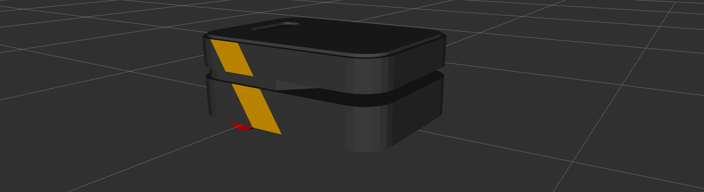

Configuration & Environment Variables
=========================================

The boxer_description package is the URDF robot description for Boxer UGV.

.. _Source: https://github.com/boxer-cpr/boxer

Overview
---------

This package provides a `URDF <http://wiki.ros.org/urdf>`_ model of Boxer.  For an example launchfile to use in visualizing this model, see `boxer_viz <http://wiki.ros.org/boxer_viz>`_.

Accessories
------------

Boxer has a suite of optional payloads called accessories. These payloads can be enabled and placed on the robot using environment variables specified at the time the `xacro <http://wiki.ros.org/xacro>`_ is rendered to URDF. Available accessory vars are:

.. raw:: html

    <table><tbody><tr> <td>
<strong>Variable</strong> 
</td>
      <td>
<strong>Default</strong> 
</td>
      <td>
<strong>Description</strong> 
</td>
    </tr>
    <tr>  <td>
<tt>BOXER_CONTROL_EXTRAS</tt> 
</td>
      <td>
<tt>0</tt> 
</td>
      <td>
??? TODO
</td>
    </tr>
    <tr>  <td>
<tt>BOXER_GPIO</tt> 
</td>
      <td>
<tt>0</tt> 
</td>
      <td>
??? TODO
</td>
    </tr>
    <tr>  <td>
<tt>BOXER_URDF_EXTRAS</tt> 
</td>
      <td>
<tt>empty.urdf</tt> 
</td>
      <td>
Path to a URDF file with additional modules connected to the robot
</td>
    </tr>
    </tbody></table>
