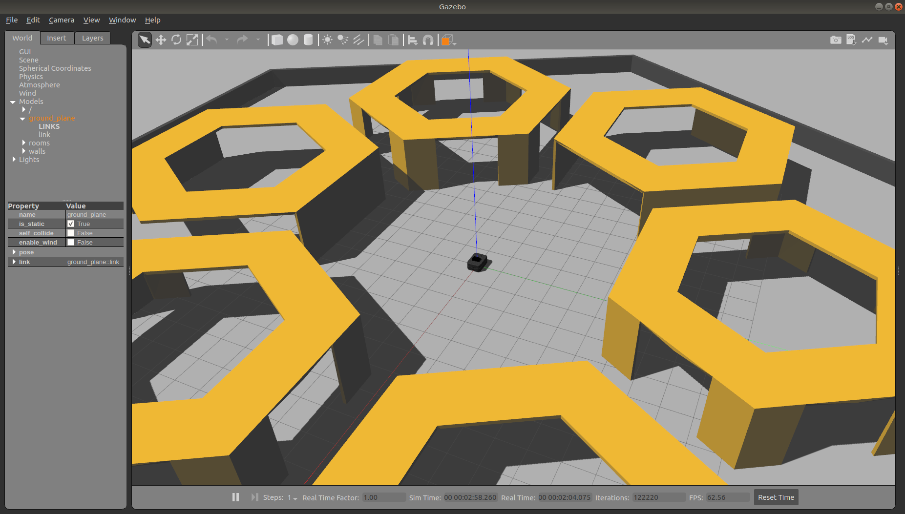
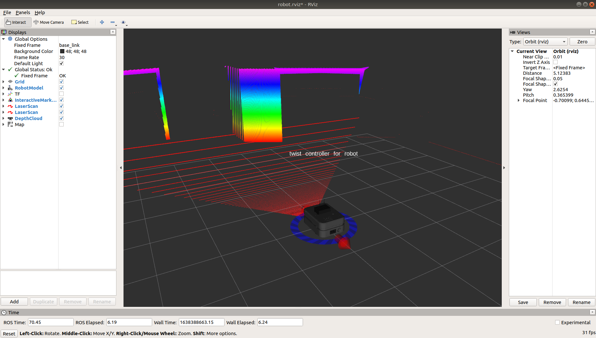

Simulating Boxer
=================

Whether you actually have a Boxer robot or not, the Boxer simulator is a great way to get started with ROS
robot development. In this tutorial, we will go through the basics of starting Gazebo and Rviz and how to drive
your Boxer around.

.. note::

  Before you can use this tutorial, make sure you have :doc:`installed Boxer's software <BoxerInstallation>`,
  including the simulation package

Launch Gazebo
-------------

Gazebo is the most common simulation tool used in ROS. Boxer's model in Gazebo include reasonable
approximations of its dynamics, including wheel slippage, skidding, and inertia. To launch simulated
Boxer in a simple example world, run the following command:

.. code-block:: bash

    roslaunch boxer_gazebo boxer_world.launch

You should see the following window appear, or something like it. You can adjust the camera angle by
clicking and dragging while holding CTRL, ALT, or the shift key:

The window which you are looking at is the Gazebo Client. This window shows you the "true" state of the
simulated world which the robot exists in. It communicates on the backend with the Gazebo Server, which
is doing the heavy lifting of actually maintaining the simulated world. At the moment, you're running
both the client and server locally on your own machine, but some advanced users may choose to run heavy
duty simulations on separate hardware and connect to them over the network.

.. note::

    When simulating Boxer, you must leave Gazebo running.  Closing Gazebo will prevent other tools, such as
    rviz (see below) from working correctly.

Launch rviz
-----------

The next tool we will encounter is :roswiki:`rviz`. Although superficially similar in appearance to Gazebo,
rviz has a very different purpose— unlike Gazebo, which shows the reality of the simulated world, rviz shows
the robot's *perception* of its world, whether real or simulated. So while Gazebo won't be used with your
real Boxer, rviz is used with both.

You can using the following launch invocation to start rviz with a pre-cooked configuration suitable for
visualizing any standard Boxer config:

.. code-block:: bash

    roslaunch boxer_viz view_robot.launch

You should see rviz appear:

The rviz display only shows what the robot knows about its world, which presently, is nothing. Because the
robot doesn't yet know about the barriers which exist in its Gazebo world, they're not shown here.

Controlling Boxer
--------------------

What is shown, however, is Boxer's interactive markers. These are the simplest way to command your robot
to move around. If you don't see them in your rviz display, select the Interact tool from the top toolbar.
You should see red arrows and a blue circle appear around the Boxer model.

Drag the red arrows in Rviz to move in the linear x and the blue circle to move in the angular z. Rviz shows you
Boxer moving relative to its odometric frame, but it is also moving relative to the simulated world supplied by
Gazebo. If you click over to the Gazebo window, you will see Boxer moving within its simulated world. Or, if you
drive real Boxer using this method, it will have moved in the real world.

All of Clearpath's robots use the same coordinate system, shown below:

.. image:: graphics/coords.png

===================== ============================= ===================
Axis                  Positive Meaning              Negative Meaning
===================== ============================= ===================
X                     Linear motion forwards        Linear motion backwards
Y                     Linear motion left            Linear motion right
Z                     Linear motion up              Linear motion down
X^ (roll)             Roll to the right             Roll to the left
Y^ (pitch)            Pitch down                    Pitch up
Z^ (yaw)              Rotate left                   Rotate right
===================== ============================= ===================

Boxer, in its default configuration, will treat the linear Y & Z axes, as well a the angular X & Y axes, as zero
at all times; the robot is incapable of moving in these directions.

Once you start your own development, have your nodes send ``geometry_msgs/Twist`` commands to the ``cmd_vel``
topic to drive Boxer, either real or simulated. This is the standard ROS interface to differential-drive and
holonomic ground vehicles.

The ``geometry_msgs/Twist`` message includes fields for linear X/Y/Z in m/s, as well as fields for angular X/Y/Z
in rad/s.

.. code-block:: bash

    $ rosmsg info geometry_msgs/Twist
    geometry_msgs/Vector3 linear
      float64 x
      float64 y
      float64 z
    geometry_msgs/Vector3 angular
      float64 x
      float64 y
      float64 z

You can also use a game controller to drive your robot.  Connect your controller using either a USB cable or Bluetooth
as appropriate and then launch the teleop node by running:

.. code-block:: bash

  roslaunch boxer_control teleop.launch joy_dev:=/dev/input/js0

Replace ``/dev/input/js0`` with the joy device you wish to use as input.  By default ``boxer_control`` accepts input
from ``/dev/input/ds4x`` unless another device is specified.  If you use a PS4 controller, you can install the
``python-ds4drv`` package through apt to install the appropriate udev rules to map your PS4 controller's ``js*`` device
to ``/dev/input/ds4x``:

.. code-block:: bash

  sudo apt-get install python-ds4drv

If you use a different game controller, e.g. an Xbox controller or Logitech F710 you will need to specify the device
using the ``joy_dev:=/dev/input/js*`` argument, described earlier.

Regardless of the controller, Axis 0 controls the robot's steering, Axis 1 controls the forward/backward velocity,
and button 4 acts as enably.  On common controllers these correspond to the following physical controls:

============= ==================================== ===== ===== =========
Axis/Button   Physical Input                       PS4   F710  Xbox One
============= ==================================== ===== ===== =========
Axis 0        Left thumb stick horizontal          LJ    LJ    LJ
Axis 1        Left thumb stick vertical            LJ    LJ    LJ
Button 4      Left shoulder button or trigger      L1    LB    LB
============= ==================================== ===== ===== =========
