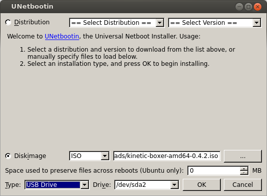

Keeping Boxer Updated
======================

Boxer is always being improved, both its own software and the many community ROS packages upon which it
depends! You can use the apt package management system to receive new versions all software running on the
platform.

Getting New Packages
--------------------

Each Boxer leaves the factory already configured to pull packages from http://packages.ros.org as well as
http://packages.clearpathrobotics.com. To update your package and download new package versions make sure that
Boxer is connected to the internet and run the following commands:

.. code-block:: bash

    sudo apt-get update
    sudo apt-get dist-upgrade

If you see any errors, please `get in touch`_ and we'll see if we can get you sorted out.

.. _get in touch: https://support.clearpathrobotics.com/hc/en-us/requests/new

MCU Firmware Update
-------------------

When you update packages, there is periodically a new version of Boxer'ss firmware available. You will know this
is the case if the firmware version number in the ``/status`` message does not match the version output by
``dpkg -s ros-kinetic-boxer-firmware``. In the future there will be an automated check for this which outputs
a diagnostics warning when a firmware update is available to be applied.

If new firmware is available, follow the below procedure to flash it to Boxer's MCU:

1. Place Boxer up on blocks. Firmware loading does not usually result in unintended motion, but it's safest when
   off the ground.
2. Log into Boxer either over SSH or by connecting a monitor, mouse, and keyboard to the robot.
3. Run the following command to update Boxer's MCU firmware:

.. code-block:: bash

    rosrun boxer_firmware upload

This command may take several seconds to complete.  Do not power-cycle the robot until uploading the firmware is
finished.

Once the command has finished, we recommend power-cycling the robot.  Once the robot reboots double-check that
the firmware is up-to-date by comparing the output of ``dpkg -s ros-kinetic-boxer-firmware`` with the firmware
version in the ``/status`` message.

.. _scratch:

Starting From Scratch
---------------------

.. warning::

    These instructions have not been rewritten for Boxer yet; there may be missing steps or additional information needed

If Boxer's computer has become inoperable, or for any reason you want to restore it to the factory state, begin
by opening Boxer's computer box, located on the rear of the robot.  The PC is easily accessible with USB, network,
and video ports available.

1. Download the latest operating system image for Boxer from http://packages.clearpathrobotics.com/stable/images/latest/
2. Use unetbootin__ or rufus__ (Windows only) to write the ISO image to a USB memory stick

.. _unetbootin: https://unetbootin.github.io/linux_download.html
__ unetbootin_

.. _rufus: https://rufus.ie/
__ rufus_

3. Connect Boxer's PC to the internet with an ethernet cable.  Also connect a monitor, mouse, and keyboard to the PC.
4. Connect Boxer to shore power to ensure it does not power down while the OS is installing.  This is optional, but
   recommended.
5. Insert the USB drive into one of the Boxer's PC's USB ports and power-cycle the PC.  You should see a purple
   Debian/Ubuntu installer.  The installer will run by itself and power off the PC when finished.  If you do
6. Remove the USB drive and power on the PC.
7. Log into Boxer.  The username is ``administrator`` and the password is ``clearpath``
8. Install Boxer's robot_upstart__ job, so that ROS will launch each time the robot starts:

.. _robot_upstart: http://wiki.ros.org/robot_upstart
__ robot_upstart_

.. code-block bash

    rosrun boxer_bringup install

You can now configure Boxer to :doc:`connect to your wi-fi <BoxerNetwork>`.
