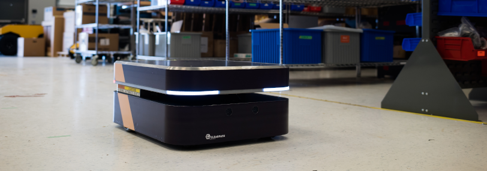

Boxer UGV Tutorials
======================

.. Note::

  This guide is for the Boxer 2.4, released in November 2021.  The Boxer 2.4 is *not* compatible with the older Boxer.
  Owners of previous-generation Boxers should refer to the documentation `here <http://www.clearpathrobotics.com/assets/guides/kinetic/boxer/>`_

This package supplies Sphinx-based tutorial content to assist you with setting up and operating your Boxer_
mobile robot. The tutorials topics are listed in the left column, and presented in the suggested reading order.

.. _Boxer: https://clearpathrobotics.com/boxer/

.. Warning::
  These tutorials assume that you are comfortable working with ROS.  We recommend starting with our
  `ROS tutorial <./../ros>`_ if you are not familiar with ROS already.

:doc:`Simulation <BoxerSimulation>` is a logical place for most users to start, as this is universally applicable;
understanding how to effectively operate Boxer in simulation is valuable whether you are in the testing
phase with software you intend to ultimately deploy on a real Boxer, or you do not have one and are
simply exploring the platform's capabilities.

:doc:`BoxerOverview` gives a comprehensive look at the physical Boxer and how the backpack PC communicates with
the underlying platform

:doc:`Driving <BoxerDriving>` covers how to teleoperate Boxer using the remote control, a well as safety procedures
for operating the real robot.  Anyone working with a physical robot should be familiar with this section.

The remainder of the subjects are focused mainly on configuring, using,
and maintaining the physical platform. If you are a lab administrator rather than direct platform user, you may wish to
skip the introductory chapters and jump straight to these ones.

.. toctree::
    :maxdepth: 3
    :caption: Contents

    Introduction <self>
    BoxerOverview
    BoxerInstallation
    BoxerPackages
    BoxerSimulation
    BoxerNavigation
    BoxerDriving
    BoxerNetwork
    BoxerStartup
    BoxerUpdate
